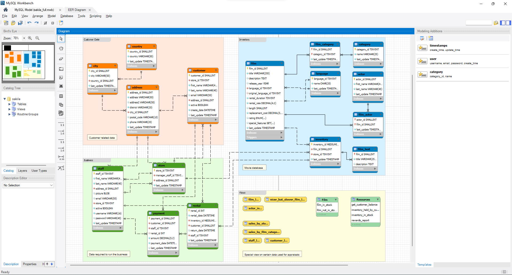
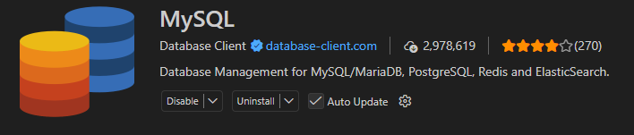

# 🚀 InsertV

> **Projeto Integrador**

O **InsertV** é uma plataforma desenvolvida com o objetivo de **abrir portas para pessoas que estão ingressando no mercado de trabalho**.

A proposta do projeto é oferecer um **site de cursos profissionalizantes**, além de uma plataforma para conectar **empresas e pessoas em busca de oportunidades de emprego**.

---

## 💻 Tecnologias utilizadas

O projeto utiliza as seguintes tecnologias:

* 🌐 **HTML**
* 🎨 **CSS**
* ⚙️ **PHP**
* 📜 **JavaScript**
* 🗄️ **MySQL**

---

# 📚 Tutorial para o grupo

## 🔗 Git e GitHub

Criem uma conta no **GitHub** e instalem o **Git**.

O Git será utilizado para o **versionamento, armazenamento e compartilhamento do código do projeto**, permitindo que todos do grupo trabalhem no mesmo repositório.

### 📥 Download

[⬇️ Baixar Git para Windows](https://git-scm.com/install/windows)

---

## 🗄️ MySQL Workbench

O **MySQL Workbench** é uma ferramenta utilizada para trabalhar com bancos de dados MySQL.

Ele permite criar e gerenciar tabelas tanto através de **comandos SQL** quanto por meio de representações visuais e relacionamentos entre tabelas.

### 📥 Download

[⬇️ Baixar MySQL Workbench](https://dev.mysql.com/downloads/workbench/)

### 🖼️ Exemplo

---

## 📋 Trello

Criem uma conta no **Trello**.

O Trello permite criar **cards, tarefas, prazos e descrições**, facilitando a organização das atividades do projeto e o gerenciamento do tempo.

### 🌐 Acesso

[➡️ Acessar o Trello](https://trello.com)

### 🖼️ Exemplo

---

# 🧩 Extensões úteis para o VS Code

## 🐘 PHP Server

A extensão **PHP Server** permite executar um servidor PHP localmente através do VS Code, facilitando o desenvolvimento e os testes do projeto.

---

## 🗄️ MySQL

A extensão do **MySQL** para o VS Code auxilia no trabalho com bancos de dados diretamente dentro do editor.

---

# 👥 Equipe

**Projeto Integrador — InsertV**

Desenvolvido como parte do Projeto Integrador.
